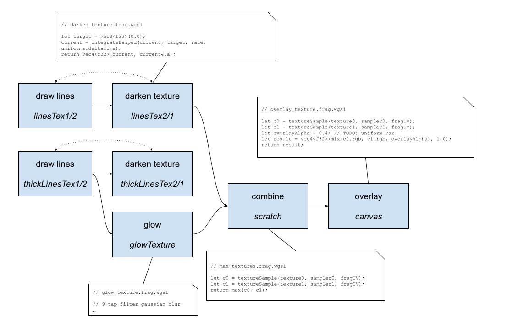

# Quaderoids

Quaderoids is an Asteroids clone written in TypeScript that targets WebGPU.

## Play

https://amaiorano.io/quaderoids/

You'll need a browser that supports WebGPU, such as [Chrome Canary](https://www.google.com/intl/en_ca/chrome/canary/). You'll need to enable `chrome://flags/#enable-unsafe-webgpu` to use it.


## About

This project was written during a "hack-week" on the WebGPU team at Google with the goal of learning and testing the [WebGPU API](//webgpu.dev).

For my part, this project was a great way to learn WebGPU, as well as [Typescript](https://www.typescriptlang.org/), [Node.js](https://nodejs.org/en/), and other web technologies. I decided to make a basic Asteroids clone for a few reasons:

1. I love old-school games, especially vector-based ones.
2. Not knowing TypeScript, Node.js, nor WebGPU, I wanted to make the game as simple as possible so that I could focus on rendering.
3. Having written a [Vectrex emulator](https://github.com/amaiorano/vectrexy) in the past that uses OpenGL to render lines with CRT-like fading and glow effects, I wanted to see how difficult it would be to reproduce these effects in WebGPU.

Finally, I just want to give proper thanks to a couple of projects that helped tremendously:

* Alain Galvan's blog post: [Raw WebGPU](https://alain.xyz/blog/raw-webgpu).
* Austin Eng's [WebGPU Samples](https://github.com/austinEng/webgpu-samples).
* Brandon Jones' [gl-matrix](https://www.npmjs.com/package/gl-matrix) JS module.

## Build

Install [Node.js](https://nodejs.org/en/). Then, 
clone the repo, and install node dependencies:

```bash
git clone https://github.com/amaiorano/quaderoids.git
cd quaderoids
npm install
```

For development, run `npm start` to start a local web server that watches and recompiles on the fly as source is changed. Navigate to http://localhost:4000 to play the game.

For production, compile the project with `npm run build`. The files will be output to the `dist/` directory.

## Design

Every game object (ship, asteroid, bullet) is represented by an array of lines, where each line is defined by 2 points (vec3s in the code, actually, to avoid converting vec2 to vec3 and back).

Each frame, the lines for all the game objects are combined into a single array of lines, and input to the rendering system. The renderer takes this array of lines and produces a vertex buffer and an index buffer. Note that each line is converted into 2 triangles, which allows me to easily vary the line width.

With the vertex and index buffers ready to go, we can now render. The following image gives an overview of how the rendering works:



Each of the boxes is a `GPUPipeline` instance, configured with a single vertex and fragment shader. The last line in each box is the target texture that this pipeline writes to.

* `draw lines` - this pipeline renders the input vertex/index buffers as is to the target texture.

* `darken texture` - this pipeline renders a full screen quad so that the fragment shader can take each fragment, and approach it's RGB value to (0,0,0) over time using a damping/drag equation. The idea here is to simulate the way CRT phosphors decay to black after a beam has excited the phospors.

* The textures used for `draw lines` and `darken texture` are swapped every frame. The textures are never cleared, since the goal is to slowly decay the rendered lines to black. So in a given frame, we draw lines to the first texture, then darken it to the next texture; this next texture becomes the first one next frame.

* `glow` - this pipeline simply performs a 9-tap [box blur](https://en.wikipedia.org/wiki/Box_blur). Each frame, we run this pipeline twice, once to blur horizontally to a scratch texture, and once more to blur this scratch texture vertically to the output texture. The goal is to create the natural glow effect of CRTs. After experimenting, I found that it looked better if the glow was applied to a thicker version of the input lines, which is why we have a second set of `draw lines` and `darken tetures` on thicker lines. Also, note that I apply the `glow` pass to the _first_ texture, not the second, because this avoids the feedback of the glow in next frame's texture (i.e. avoids previous frame's glow affecting next frame's glow).

* `combine` - this pipeline samples and combines the texels from the darkened lines texture and the glow texture, taking the max of either texel.

* `overlay` - this pipeline alpha blends a background image - a space scene with the game's title - with the input texture.

That's it! This rendering approach is basically what I used in [Vectrexy](https://github.com/amaiorano/vectrexy), and I'm sure there are much better ways to achieve this (or better), but I was happy to see that it was easy enough to port this type of rendering strategy from OpenGL to WebGPU.
